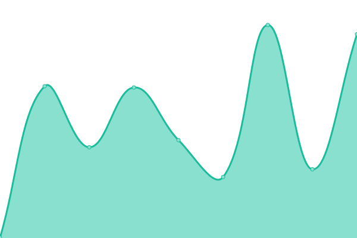
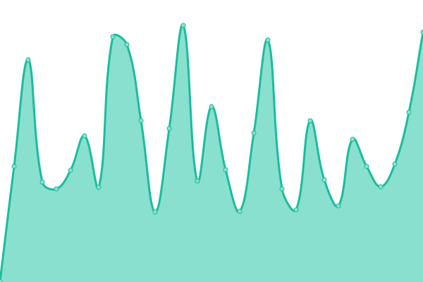

# [📈 Live Status](https://caryrx.github.io/Upptime): <!--live status--> **🟩 All systems operational**

This repository contains the open-source uptime monitor and status page for [Cary Health](www.caryrx.com), powered by [Upptime](https://github.com/upptime/upptime).

With [Upptime](https://upptime.js.org), you can get your own unlimited and free uptime monitor and status page, powered entirely by a GitHub repository. We use [Issues](https://github.com/caryrx/Upptime/issues) as incident reports, [Actions](https://github.com/caryrx/Upptime/actions) as uptime monitors, and [Pages](https://caryrx.github.io/Upptime) for the status page.

<!--start: status pages-->
<!-- This summary is generated by Upptime (https://github.com/upptime/upptime) -->
<!-- Do not edit this manually, your changes will be overwritten -->
<!-- prettier-ignore -->
| URL | Status | History | Response Time | Uptime |
| --- | ------ | ------- | ------------- | ------ |
|  [Clair](https://askclair.ai) | 🟩 Up | [clair.yml](https://github.com/caryrx/Upptime/commits/HEAD/history/clair.yml) | 

 352ms
     
 | 

<a href="https://status.caryrx.com/history/clair">100.00%</a>
    

|  [OnLabel](https://onlabel.ai) | 🟩 Up | [on-label.yml](https://github.com/caryrx/Upptime/commits/HEAD/history/on-label.yml) | 

 647ms
     
 | 

<a href="https://status.caryrx.com/history/on-label">100.00%</a>
    

|  [GalenAI](https://prod.askclair.ai/api/v1/helpers/get-hint) | 🟩 Up | [galen-ai.yml](https://github.com/caryrx/Upptime/commits/HEAD/history/galen-ai.yml) | 

 976ms
     
 | 

<a href="https://status.caryrx.com/history/galen-ai">99.12%</a>
    

|  [OneDash](https://onedash.cary.health) | 🟩 Up | [one-dash.yml](https://github.com/caryrx/Upptime/commits/HEAD/history/one-dash.yml) | 

 139ms
     
 | 

<a href="https://status.caryrx.com/history/one-dash">100.00%</a>
    

|  [Workbench](https://workbench.caryrx.com) | 🟩 Up | [workbench.yml](https://github.com/caryrx/Upptime/commits/HEAD/history/workbench.yml) | 

 111ms
     
 | 

<a href="https://status.caryrx.com/history/workbench">100.00%</a>
    

|  [CaryConnect](https://caryconnect.cary.health) | 🟩 Up | [cary-connect.yml](https://github.com/caryrx/Upptime/commits/HEAD/history/cary-connect.yml) | 

 181ms
     
 | 

<a href="https://status.caryrx.com/history/cary-connect">100.00%</a>
    

|  [Cary API](https://api5.caryrx.com/v1/zipcodes/20001) | 🟩 Up | [cary-api.yml](https://github.com/caryrx/Upptime/commits/HEAD/history/cary-api.yml) | 

 176ms
     
 | 

<a href="https://status.caryrx.com/history/cary-api">100.00%</a>
    

|  [Kinetica](https://prelive.caryrx.com/v1/health/kinetica) | 🟩 Up | [kinetica.yml](https://github.com/caryrx/Upptime/commits/HEAD/history/kinetica.yml) | 

 226ms
     
 | 

<a href="https://status.caryrx.com/history/kinetica">100.00%</a>
    

<!--end: status pages-->

[**Visit our status website →**](https://caryrx.github.io/Upptime)

## 📄 License

- Powered by: [Upptime](https://github.com/upptime/upptime)
- Code: [MIT](./LICENSE) © [Anand Chowdhary](https://anandchowdhary.com), supported by [Pabio](https://pabio.com)
- Data in the `./history` directory: [Open Database License](https://opendatacommons.org/licenses/odbl/1-0/)
